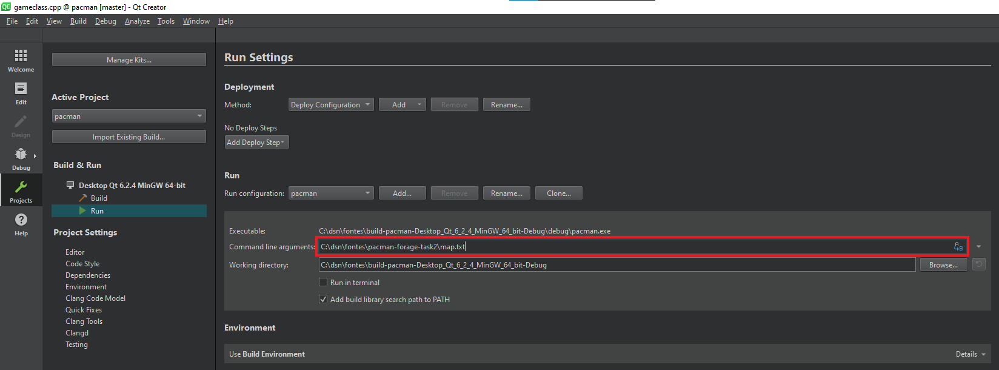

# Pacman -  Vax-Man

## EA Task 2. Changing an open-source pacman in c++ with Qt framework.

### Background information about the task
   New Rules:
 * Vax-Man can kill a ghost if he comes into contact with it (vaccinates it).
 * Contact with a ghost does not kill Vax-Man.
 * Each ghost that has not yet been hit multiplies itself every 30 seconds (the infection grows).
 * The goal of the game is to collect all the dots before the number of ghosts grows to 32 times the original number.

### How configure QT Creator to run it:
 * Open Qt Creator.
 * Set the map.txt in: Projects > Build&Run > Run > Command line argumentss = "Select the map.txt in the project folder".

